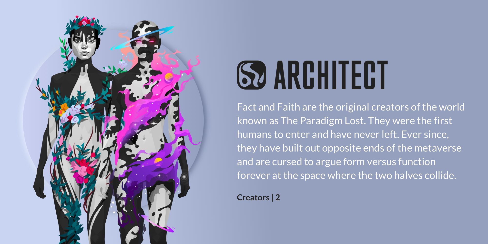

import Bleed from 'nextra-theme-docs/bleed'

# The Talents of CyberBrokers

## AdBuddy

### DESC

Walking down the strip, you may be accosted by an AdBuddy. Do not be afraid. They're really excited to show you all the latest gizmos and gadgets. After all, a discount coupon for the latest Dreamscapes can be a very valuable thing.

### ICON

<Bleed></Bleed>

### CARD

---

## AI

### DESC

As the first attempts at manmade artificial intelligence, the AI has shown, at times, remarkable indifference set alongside a fierce hatred. Do not let their cuddly appearance lull you into complicity. They are indeed after all of your toys.

### ICON

<Bleed></Bleed>

### CARD

---

## Alien

### DESC

No one is sure where the these aliens came from. One theory is that they arrived hundreds of years ago on the planet Earth, soon to be hustled to Area 51 where they were hooked up to all manner of overly energetic devices.

### ICON

<Bleed></Bleed>

### CARD

---

## Android

### DESC

Not all CyberBrokers wished to retain their original physical form as their digital afterimage. In fact, a few decided to shed their fleshy forms and embrace an array of plastic and stainless steel parts. These forms turned out much more resistant to nibbles from the AI.

### ICON

<Bleed></Bleed>

### CARD

---

## Architect

### DESC

Fact and Faith are the original creators of the world known as The Paradigm Lost. They were the first humans to enter and have never left. Ever since, they have built out opposite ends of the metaverse and are cursed to argue form versus function forever at the space where the two halves collide.

### ICON

<Bleed></Bleed>

### CARD

<Bleed></Bleed>

---

## Assassin

## DESC

## ICON

<Bleed></Bleed>

## CARD

---

## Astronomer

## DESC

## ICON

<Bleed></Bleed>

## CARD

---

## Busker

## DESC

## ICON

<Bleed></Bleed>

## CARD

---

## Cammer

## DESC

## ICON

<Bleed></Bleed>

## CARD

---

## Chef

## DESC

## ICON

<Bleed></Bleed>

## CARD

---

## Talent

## DESC

## ICON

## CARD

---

## Talent

## DESC

## ICON

## CARD

---

## Talent

## DESC

## ICON

## CARD

---

## Talent

## DESC

## ICON

## CARD

---

## Talent

## DESC

## ICON

## CARD

---