import Bleed from 'nextra-theme-docs/bleed'

# The Talents of CyberBrokers

<Bleed></Bleed>

## Ad Buddy

Walking down the strip, you may be accosted by an AdBuddy. Do not be afraid. They're really excited to show you all the latest gizmos and gadgets. After all, a discount coupon for the latest Dreamscapes can be a very valuable thing.

<Bleed></Bleed>

<Bleed></Bleed>

---

## AI

As the first attempts at manmade artificial intelligence, the AI has shown, at times, remarkable indifference set alongside a fierce hatred. Do not let their cuddly appearance lull you into complicity. They are indeed after all of your toys.

<Bleed></Bleed>

<Bleed></Bleed>

---

## Alien

No one is sure where the these aliens came from. One theory is that they arrived hundreds of years ago on the planet Earth, soon to be hustled to Area 51 where they were hooked up to all manner of overly energetic devices.

<Bleed></Bleed>

<Bleed></Bleed>

---

## Android

Not all CyberBrokers wished to retain their original physical form as their digital afterimage. In fact, a few decided to shed their fleshy forms and embrace an array of plastic and stainless steel parts. These forms turned out much more resistant to nibbles from the AI.

<Bleed></Bleed>

<Bleed></Bleed>

---

## Architect

Fact and Faith are the original creators of the world known as The Paradigm Lost. They were the first humans to enter and have never left. Ever since, they have built out opposite ends of the metaverse and are cursed to argue form versus function forever at the space where the two halves collide.

<Bleed></Bleed>

<Bleed></Bleed>

---

## Assassin

Assassins are relentless about working alone because there can only be one highest bidder. Experts in the dematerialization of their targets, you can bet that if you're on their list, it'll be when your hot wallet is full. Assuming you've anything to left to wager, of course.

<Bleed></Bleed>

<Bleed></Bleed>

---

## Astronomer

Digital astronomy is as much about the discovery of distant new regions as it is about the explicit manifestation of such. Astronomers are forever exploring the outer limits of where the largest random seeds wield their outsized influence over the far parts of the simulation.

<Bleed></Bleed>

<Bleed></Bleed>

---

## Busker

Powered by pure joy and a smidge of insanity, Buskers can be found entertaining throngs of Drifters throughout TPL with their skills. From busy street corners, to dark clubs along The Strip. The very best are always in demand as high as their volume.

<Bleed></Bleed>

<Bleed></Bleed>

---

## Cammer

Not all content is created equal. Some is created, splayed across silken sheets, while finding lithe, chordal slopes, and glistening thick with the heavy scent of crushed water lilies and melancholy. All of it captured in hi-res 'grams for a fat stack of coin and your sweaty pleasure.

<Bleed></Bleed>

<Bleed></Bleed>

---

## Chef

The blood and food may not be real, but Chefs can cook up equisite experiences for their patrons according to the culinary digital arts. From the delicate crunch of a pink lady to the meaty smack of a slab of brisket, you won't miss the runny gruel from your IRL hovel.

<Bleed></Bleed>

<Bleed></Bleed>

---

## Chemist

Someone needs to parboil those herbs down into usable reagents for your health potion. Particularly when it comes to certain large, industrial vats of purple fluid. And, don't forget, no one wants to d-mez because they didn't adequately tip the Chemist for a bespoke stamina boost.

<Bleed></Bleed>

<Bleed></Bleed>

---

## Cleanup Crew

Primarily Cleanup Crew are employed to repair and upgrade older bits of TPL's simulation assets to newer, more modern standards. Since the world is constantly in motion with new drops and formations, it is a neverending job. Which, of course, makes them very twitchy.

<Bleed></Bleed>

<Bleed></Bleed>

---

## Courier

When your data stick absolutely needs to be there on time and handed off in-person, there is no other option than a Courier. And all it'll cost you is two days' wages for fast-travel fees and hazard pay. Delivered in three minutes or it's still not free.

<Bleed></Bleed>

<Bleed></Bleed>

---

## Cultist

They may seem a little WAGMI from the outside, but they assure us once you peek beneath the surface, there's no unseeing it. You are forever changed. But, it's not as scary as all that. All you need to do is lay out some coin and swap into the black. There's a reason anyone who does, never comes back.

<Bleed></Bleed>

<Bleed></Bleed>

---

## Dealer

Because a TPL Rig is wired directly into the brains of Drifters, there is an enormous opportunity to artificially stimulate the meatspace bundles of axons, increasing mental clarity, focus & cognitive performance. However, not everyone enjoys getting high on their own power supply.

<Bleed></Bleed>

<Bleed></Bleed>

---

## Degen

Digital fanboys and fangirls, flipping out about the next hottest thing can be irritating to some people, but not us. We love looking in the mirror and seeing a Degen. Swimming in endless joy, potential, and optimism. Breathing in deep of that strawberry-flavored hopium. Degen forever.

<Bleed></Bleed>

<Bleed></Bleed>

---

## Demon

Demons specialize in penetration. Infiltrating and infecting your underlying core systems. When cornered, Demons fight, fangs bared, and slashing before finally vanishing. Rumor has it their goth-black ability even impels PVP features into non-PVP zones where, at any moment, the ground might erupt in wings and talons.

<Bleed></Bleed>

<Bleed></Bleed>

---

## Dreamer

What happens when lucid dreamers have their brains wired into the metaverse? Viscuous sprays of color and mentation coat the world wherever they wander. Which means the ability to manifest whatever glorious tinsel springs to mind makes them awfully hard to miss at a party.

<Bleed></Bleed>

<Bleed></Bleed>

---

## Enforcer

When you're having a large event and need someone to check NFTs at the door, Enforcers are the toons you portal in for the job. They're sturdy, strong, and intimidating, just like your girl's ex-boyfriend. So, don't forget your fat roll of 100s if have been 'mistakenly' left off the list.

<Bleed></Bleed>

<Bleed></Bleed>

---

## Gambler

They say professional poker players make the best strategy gamers. It's because the ability to runtime calculate probabilities is an extreme advantage in digital combat. You have to know when to hatchet, know when to run, and always make sure to watch the eyes.

<Bleed></Bleed>

<Bleed></Bleed>

---

## Gargoyle

Trained in everything from packet sniffing to ray casting to sample slicing, these TPL spies are able to record and recreate any situation they witness, anywhere in the metaverse. However, their bulky, beeping gear tends to make it easy to catch them looking over your shoulder.

<Bleed></Bleed>

<Bleed></Bleed>

---

## Gene Editor

Looking for an extra set of wings for your TPL avatar? They can help. Just, be aware that it will cost you. Probably more than you're willing to pay, and not in the way you're willing to pay for it.

<Bleed></Bleed>

<Bleed></Bleed>

---

## Gunter

It all began with the use of steganography to hide private keys throughout works of art. From that simple act, an entirely new class of Explorers was born. And, ever since their success with that first easter egg, they've started running in small packs. Gunters are natural puzzle solvers and live to conquer the next quest.

<Bleed></Bleed>

<Bleed></Bleed>

---

## Hacker

Look around you. Everything in TPL is made from code. Hackers hunt from far corner to far corner, querying rough edges for exploits. Sometimes, they'll take commission, but, more than likely, if they're talking to you, be polite. There's a very expensive reason why you should.

<Bleed></Bleed>

<Bleed></Bleed>

---

## Holo

Holos sit at the highest level of communication. Able to wink in and out of any corner in TPL, they make the ideal messengers for the most powerful metaverse denizens. Chances are, if you see one, you probably don't want to be there. For multiple reasons. Run.

<Bleed></Bleed>

<Bleed></Bleed>

---

## Incumbent

Behind every successful Politician are dozens of Incumbents. And, it takes dozens to smoothly run an office because their goldfish brains keep forgetting what they were doing every time they enter the room. On the bright side, it means they're pretty worthless to kidnap for information on their bosses. Assuming they even remember who they work for.

<Bleed></Bleed>

<Bleed></Bleed>

---

## Leftover

Not every Cyberbroker is born with an innate talent. They are the Leftovers. Jacks of all trades, but masters of none. Can't find an Enforcer? Grab some Leftovers instead. After all, there's probably a reason they're still alive after a couple centuries.

<Bleed></Bleed>

<Bleed></Bleed>

---

## Looter

Even in TPL, digital items can fall off the back of a truck. Well, maybe more like they can be found, but after being lost and forgotten on the Strip. Kind of. More like laying lost along the Strip, but if the Strip was actually a private wallet. I mean, they're just sitting there for anyone to take, right?

<Bleed></Bleed>

<Bleed></Bleed>

---

## Mechanic

Sometimes you have stretched UV maps. Other times, it's a broken DLC patch. Regardless of what corner of TPL is busted, Mechanics have the right tool for the job. They're expensive, but you're going to have to call them anyway after you try and fix it yourself.

<Bleed></Bleed>

<Bleed></Bleed>

---

## Mercenary

Their loyalties are always clear. Mercenaries are loyal to the almighty coin first, and whoever is paying them second. Once a contract is signed, they cannot be disuaded, they do not come alone, and they cannot be stopped. As long as you can foot the bill, they're a blue chip asset.

<Bleed></Bleed>

<Bleed>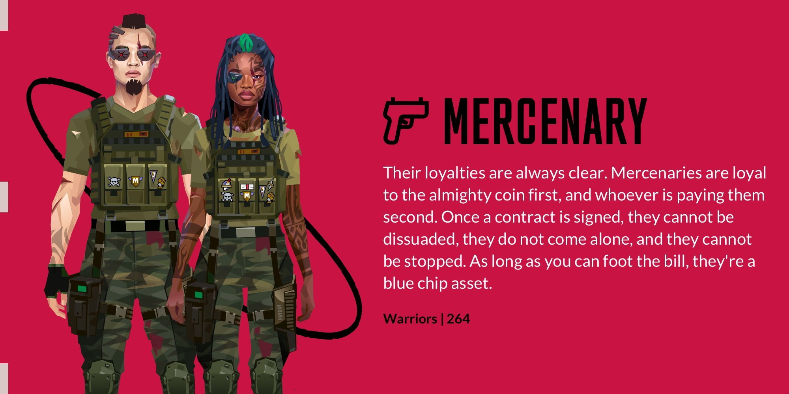</Bleed>

---

## Merchant

Have you ever wondered where all the TPL marketplaces get their merchandise? They can't all have personal relationships with every creator. Merchants fill that need by buying from the original creators, then flipping those assets to the shop owners. Stealing from them would probably be very lucrative. Also very, very stupid.

<Bleed></Bleed>

<Bleed>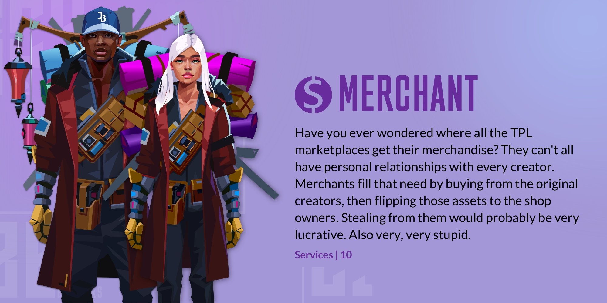</Bleed>

---

## Meta Explorer

First into the breach, MetaExplorers are the vanguard ripping through TPL. They swarm, battling to be the one to solve the puzzle. First to defeat any BBEG. First to reach any destination. Point them in a direction, then get the hell out of the way.

<Bleed></Bleed>

<Bleed>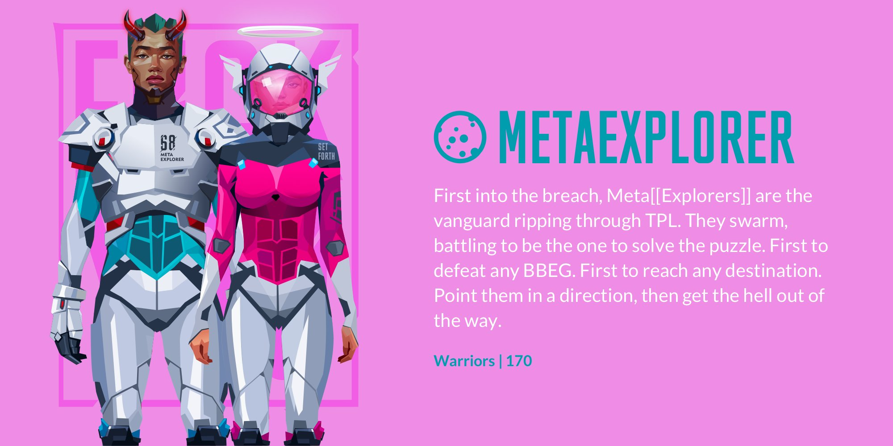</Bleed>

---

## Miner

In the bowels of TPL there is a core layer of substrate which enables baseline systems to function. This nets a perfect, balanced ecology -- until it doesn't. The 21 Miners are there, searching, constantly calculating potential outcomes, digging for any event deviating from ecological consensus, and culling it.

<Bleed></Bleed>

<Bleed>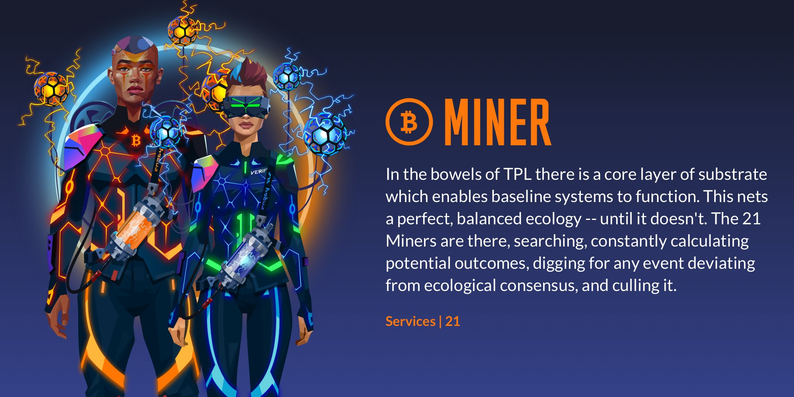</Bleed>

---

## Nun

There are old stories around gentle folk of the cloth, traveling as peaceful missionaries. These are not them. These warrior Nuns will and do hunt both Cultists and Demons in an attempt to exterminate their kind from TPL. The toll is heavy, but their prey's numbers are dwindling.

<Bleed></Bleed>

<Bleed>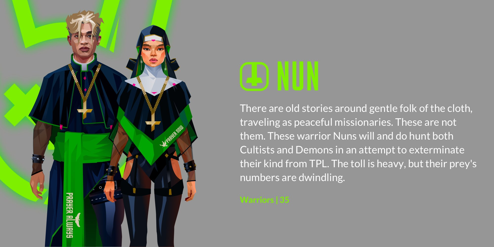</Bleed>

---

## Nurse

Debugging and refactoring. Nurses spend the majority of their day fixing slagged objects throughout TPL. Unfortunately, often arriving long after they should have been notified of the need. Masters of sweeping littered bits from the floor, they're typically overworked and under-comped, so irritating them is not advisable.

<Bleed></Bleed>

<Bleed>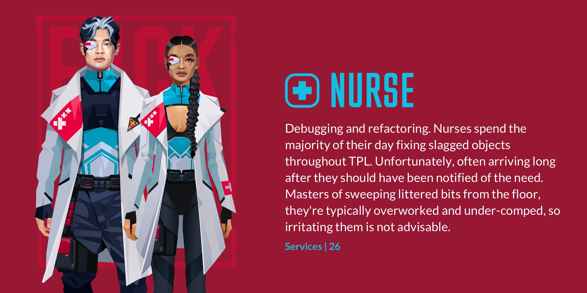</Bleed>

---

## Phisherman

Catch and release' is the joke. It's catching a whale and getting them to release their grip on their loot. Phishermen will bait traps and wait for unsuspecting prey to stumble along, always searching for that last, elusive great whale. Just one more hook.

<Bleed></Bleed>

<Bleed>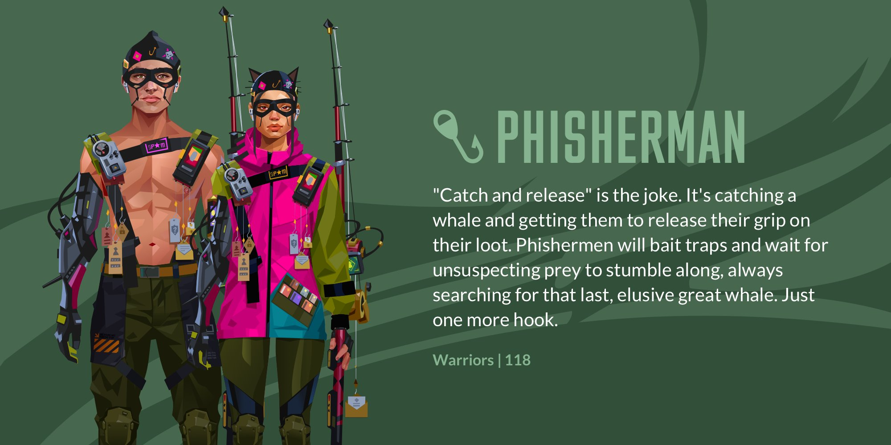</Bleed>

---

## Pilot

In order to originally select which Brokers would be eligible to pilot TPL's official ships, tanks, and giant robots, the founders held fast-twitch competitions, and the winners were thrown into Pilot suits before the losers could re-mez.

<Bleed></Bleed>

<Bleed>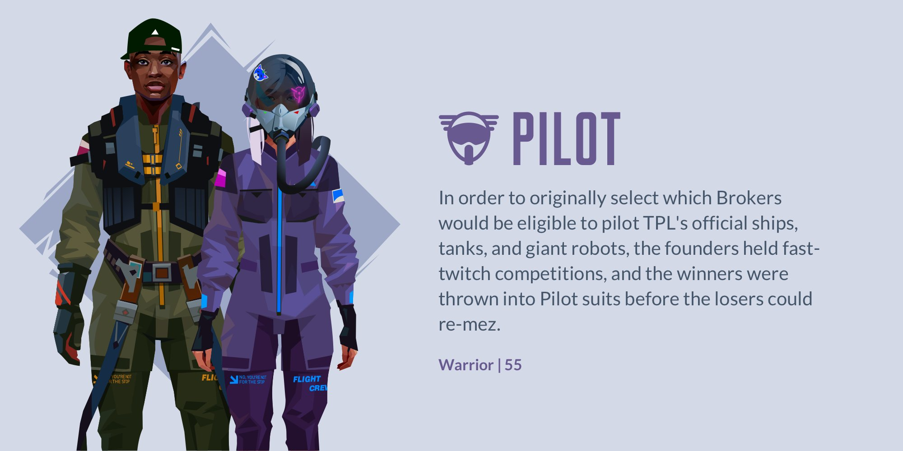</Bleed>

---

## Politician

As the very first denizens of TPL, the Politicians started as a small group of lab chimpanzees, wired into an early harness prototype as an attempt to determine the safety levels around Connection. These early rigs were not safe. Later, it was discovered the chimps' harnesses had destroyed the neurotransmitters associated with empathy.

<Bleed></Bleed>

<Bleed>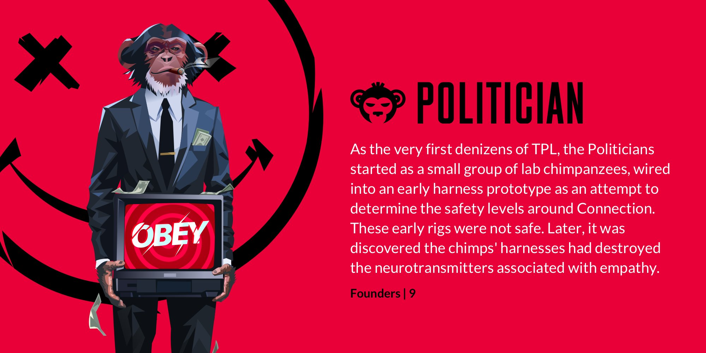</Bleed>

---

## Puzzle Master

Historically, city planners have designed the intersections of space and people. However, in the real world, there are vastly different needs for a physical-based populace. When the basics like food and shelter aren't needed, everything becomes a game.

<Bleed></Bleed>

<Bleed>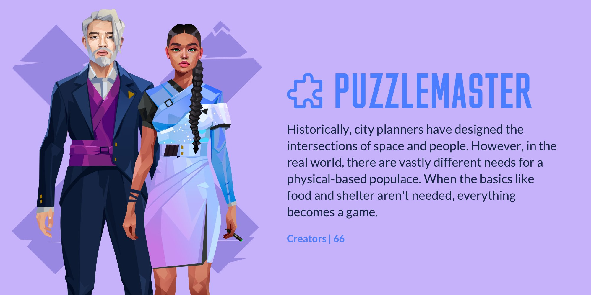</Bleed>

---

## Rat

The inhalation of mind-altering chemicals was originally considered as a bridge to the metaverse. Chemically inducing a favorable alignment of synapses proved helpful in onboarding the very first lab rats to the TPL. However, the process was abandoned after failing for humans, and those first rats have since traversed the gateway into headier, more colorful fumes.

<Bleed></Bleed>

<Bleed>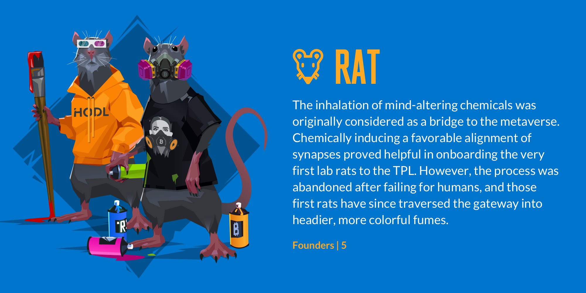</Bleed>

---

## Samurai 

Each Samurai has pledged themselves to one of the 9 Politicians, and have subsequently become mired in their masters' machinations. Though, hilt-deep and bathed in blood as they are, you would never know. 'The undisturbed mind is like the calm body water reflecting the brilliance of the moon.'

<Bleed></Bleed>

<Bleed>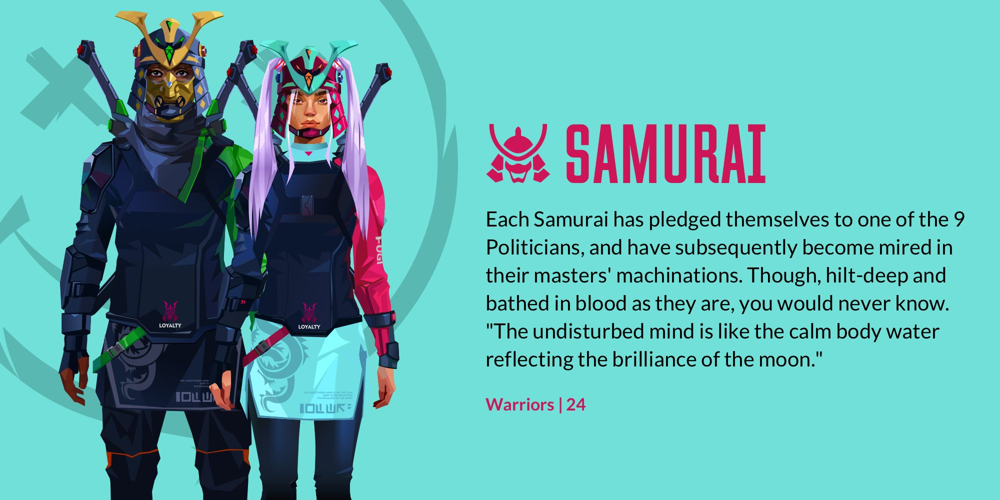</Bleed>

---

## Script Kitty

Script Kitties tend to be aloof and disinterested with a constant sense of superiority. However, once they discover something that piques their interest, particularly something related to annoying someone, they pounce, quickly cobbling together a string of automated scripts, much to the irritation of their victims.

<Bleed></Bleed>

<Bleed>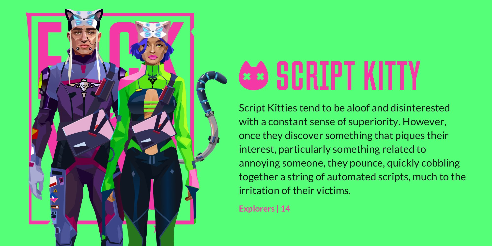</Bleed>

---

## Shaman

Flaring cloaks, bone poultices, and glamorous headgear make it hard to miss these combat medics on the battlefield. Especially on busy days when they conjure sixty meter-high guardian totems to provide cover for their healing ministrations. Because the best defense is a soul-crushing offense.

<Bleed></Bleed>

<Bleed>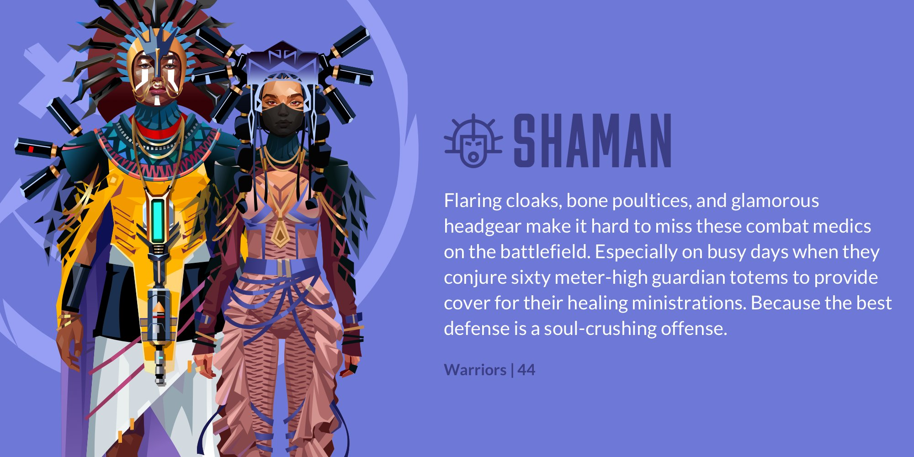</Bleed>

---

## Sheeple

Every story has its villain. Sometimes they're a giant dragon. Sometimes they're an antiquated drone still running on Cobol that circles your head, snapping 'grams, and blasting, 'You are now mine!' in between beats of modem static noise. Usually, though, it's just a flock of Sheeple blocking the road.

<Bleed></Bleed>

<Bleed>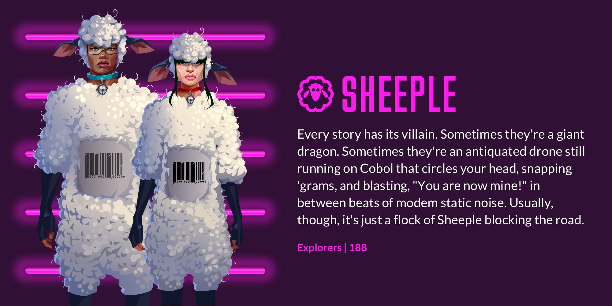</Bleed>

---

## Skull

When you're bone-thin, you tend to hide that percieved weakness beneath bulky outerwear. If you're a Skull, it's for a completely different reason. By blending in with the crowd, no one will notice your victim getting shivved by a femur shard until it's too late.

<Bleed></Bleed>

<Bleed>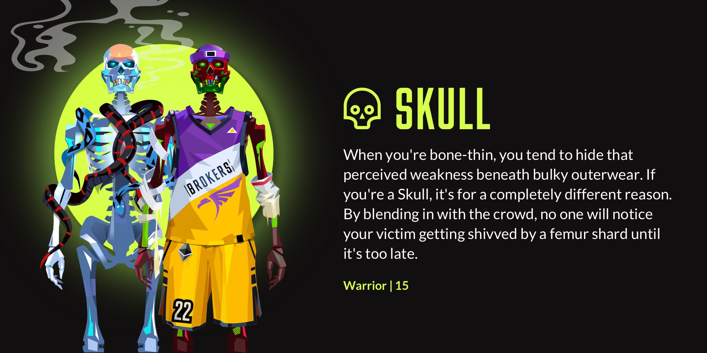</Bleed>

---

## Smuggler

Making loot vanish is a rare skill. Rarer still, is the ability to make it reappear. Smugglers have perfected tactics like flipping normals to hide their booty from suspicious eyes. Once on the other side of the delivery, everything is returned. Everything, of course, except for a few bits skimmed off the backside.

<Bleed></Bleed>

<Bleed>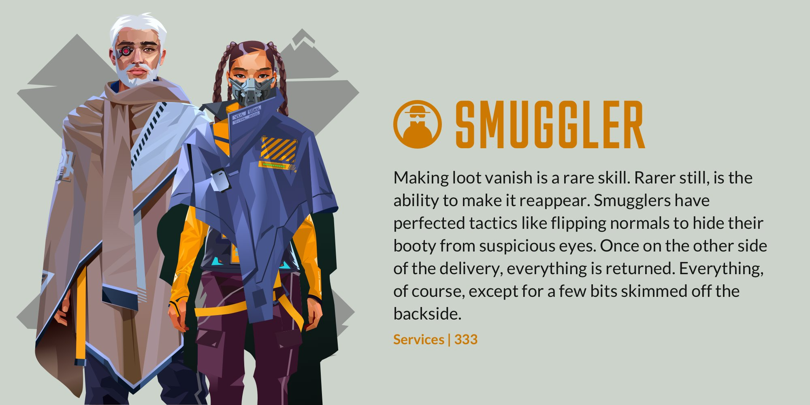</Bleed>

---

## Snowcrashed

The mind is less impenetrable than some believe. There are a few brokers who have donned their rigs, looked into the light, and are worse off for it. These are the Snowcrashed. At least, we assume they're worse off. It would be strange if, instead, they were actually operating on a completely different plane.

<Bleed></Bleed>

<Bleed>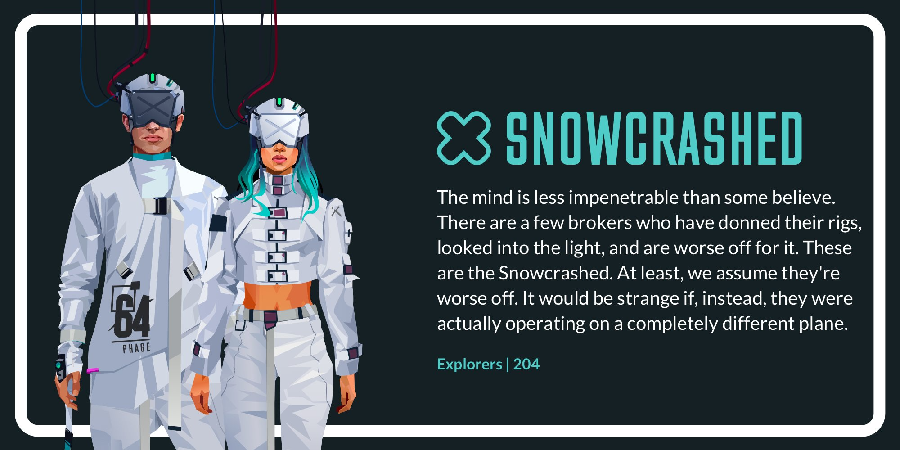</Bleed>

---

## Source

The light. The source. The originator of all. Asherah was the first CyberBroker and all that came after her began their existence starting with her genetic algorithms. She is the reason TPL exists.

<Bleed></Bleed>

---

## Spectre

You will not detect a Spectre trailing you. Understand that. However, hopefully, they're only gathering information for a client. Consummate sleuths, a Spectre will ask questions first, blow holes later. Most of the time. Well, to be fair, we've only heard stories so can only assume. Just don't look behind you, and you'll be fine.

<Bleed></Bleed>

<Bleed>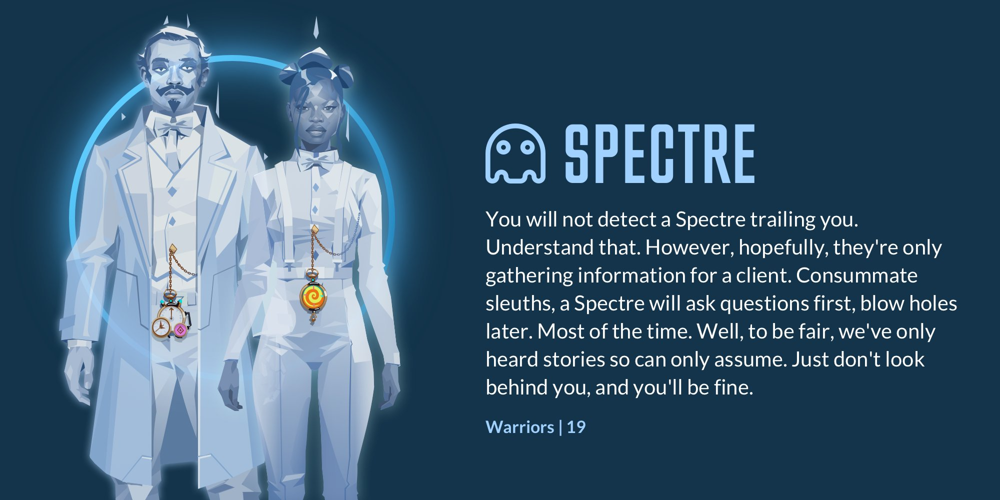</Bleed>

---

## Tripper

Inspiration and enlightenment often flow in the same direction, but originate from separate sources. Be like the outcropping that nudges the two together and channels them into parallel paths. Only then are you an oarsman on their river journey, coming together as two parts of a whole. I am so high right now.

<Bleed></Bleed>

<Bleed>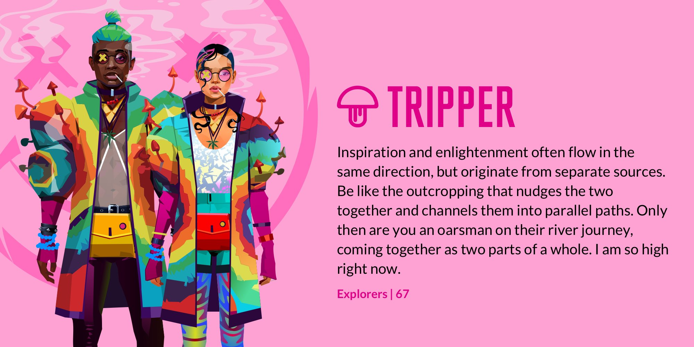</Bleed>

---

## Yieldfarmer

Yieldfarmers tend to spend an other-worldly amount on gas, but that's the price you pay for those juicy returns. This isn't like your grandfather's crop, and there isn't much time for the herd of sheeple. It's stake and farm and stake and farm, forever chasing that four-digit APY.

<Bleed></Bleed>

<Bleed>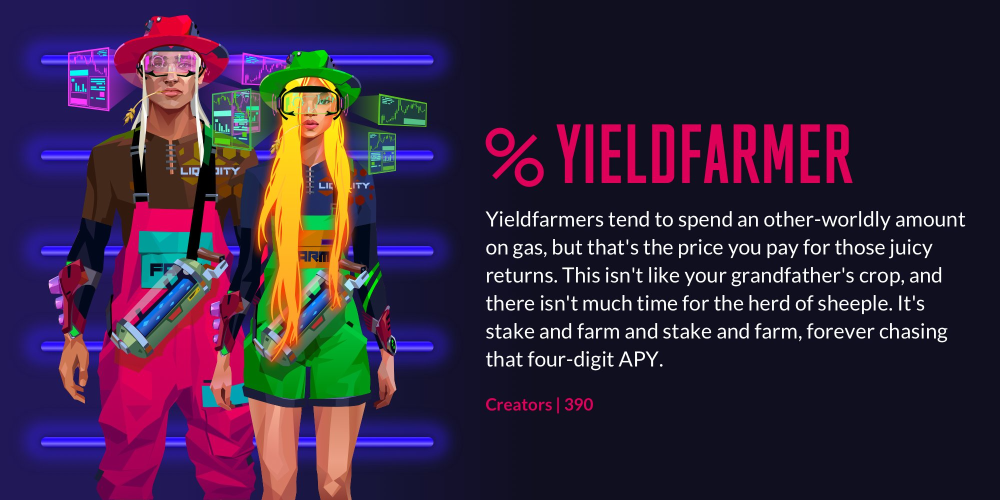</Bleed>

---